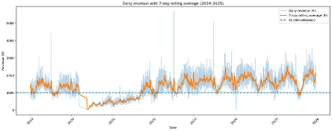
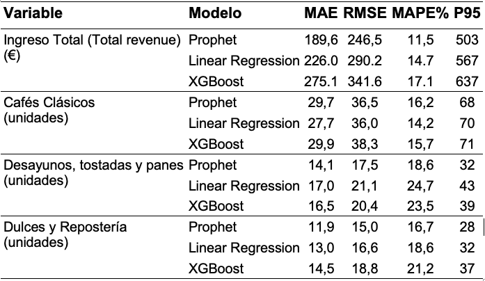
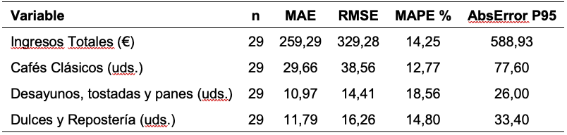
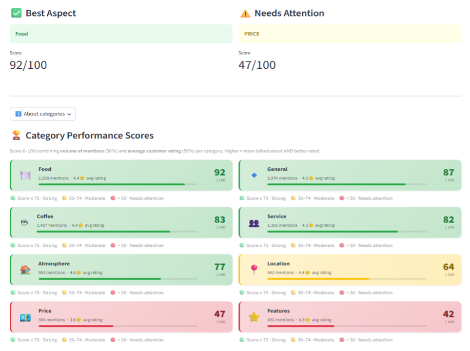
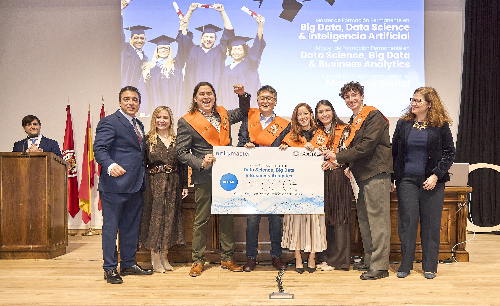

```{=html}
<nav class="page-nav">
  <div class="page-nav-links">
    <a href="#project-details">Project details</a>
    <a href="#video-demo">Video demo</a>
    <a href="#team-awards">Team &amp; Awards</a>
    <a href="#contact">Contact</a>
  </div>
  <div class="page-nav-lang">
    <a href="./">EN</a>
    <a href="../es/">ES</a>
  </div>
</nav>
```

::: {#top .hero-shell}
# Pythia - data science for cafeterias { .hero-title }

::: {.hero-subtitle}
Master’s final project for the Master in Data Science at UCM/NTIC, combining demand forecasting and customer review analysis into a practical decision-support tool for specialty cafés.
:::

```{=html}
<div class="hero-skills">
  <span class="skill-chip">CRISP-DM</span>
  <span class="skill-chip">ETL / Data Preparation</span>
  <span class="skill-chip">Exploratory Data Analysis</span>
  <span class="skill-chip">Feature Engineering</span>
  <span class="skill-chip">Time-Series Forecasting</span>
  <span class="skill-chip">Prophet</span>
  <span class="skill-chip">NLP / Text Mining</span>
  <span class="skill-chip">YAKE</span>
  <span class="skill-chip">Sentence-BERT</span>
  <span class="skill-chip">Model Evaluation</span>
  <span class="skill-chip">Competitive Benchmarking</span>
  <span class="skill-chip">Streamlit Deployment</span>
</div>
```

::: {.badge-row}
::: {.hero-badge}
<strong>Real operating context</strong>
<span>Built around real specialty-café sales dynamics, customer sentiment, and external demand drivers.</span>
:::
::: {.hero-badge}
<strong>Integrated analytical workflow</strong>
<span>Connects forecasting, benchmarking, and text mining in one coherent decision-support system.</span>
:::
::: {.hero-badge}
<strong>Recognized delivery</strong>
<span>Awarded the maximum grade and 2nd place in a pitch contest.</span>
:::
::: {.hero-badge}
<strong>Practical output</strong>
<span>Delivered as a Streamlit application designed to support day-to-day business decisions.</span>
:::
:::

::: {.cta-row}
[Watch Demo](#video-demo){.cta-button .cta-tertiary}
:::
:::

## Project Details {#project-details .section-title}

Pythia is designed to read as one practical story: the operating problem comes first, then the data and methodology, then the modeling decisions, and finally the measurable value of the deployed result.

::: {.detail-grid}
::: {.content-card .detail-card .simple-card}
### Business Problem

Specialty cafés in high-traffic urban markets face a difficult operating model: tight margins, perishable stock, volatile demand, and strong competition. Small planning errors can materially affect profitability through waste, missed sales, and labor inefficiency. This project supports better decision-making by combining sales forecasting and customer review analysis to guide purchasing, staffing, and operational improvement priorities.
:::

::: {.content-card .detail-card}
### Data and Methodology

The project follows a CRISP-DM workflow and combines structured and unstructured sources into one analytical pipeline. Inputs include nearly 990k real sales records from January 2019 to December 2025, more than 2,500 customer reviews, roughly 6,000 competitor reviews, and external variables such as weather, holidays, and CaixaForum visitor flow.

This creates a single decision-support framework that links operational performance, customer sentiment, and contextual demand factors in a way that is technically rigorous but still readable for business stakeholders.

{.detail-visual}

::: {.detail-caption}
Figure 1. Daily total revenue and 7-day moving average, with a EUR 1,000 reference line (2019-2025).
:::
:::

::: {.content-card .detail-card}
### Modeling

For forecasting, Prophet was selected after comparison with Linear Regression and XGBoost, offering the best balance between accuracy, robustness, and interpretability. For text mining, the pipeline combines YAKE, NLTK, and Sentence-BERT to automatically extract, normalize, and group customer feedback themes from reviews.

This keeps the modeling strategy grounded: alternative approaches are benchmarked seriously, but the final system favors methods that can be explained, monitored, and used in a real operating setting.

{.detail-visual}

::: {.detail-caption}
Table 1. Prophet vs. Linear Regression vs. XGBoost on the full 2025 test set.
:::
:::

::: {.content-card .detail-card}
### Results and Impact

The forecasting models achieved strong results, with total revenue prediction reaching about 11.74% MAPE in validation and 14.25% in production monitoring for January 2026. Review analysis identified food, coffee, and service as clear strengths, while price emerged as the main improvement area.

Both components were deployed in a Streamlit app, turning the project into a practical business tool rather than a static analytical report.

{.detail-visual}

{.detail-visual}

::: {.detail-caption}
Table 3. Production evaluation metrics for Prophet models, January 2026.

Figure 8. Screenshot of the Pythia app review analysis module.
:::
:::
:::

## Video Demo {#video-demo .section-title}

::: {.youtube-frame}
<iframe src="https://www.youtube.com/embed/gkD9bKw1ikY" title="Pythia demo video" allow="accelerometer; autoplay; clipboard-write; encrypted-media; gyroscope; picture-in-picture; web-share" allowfullscreen></iframe>
:::

## Team & Awards {#team-awards .section-title}

::: {.split-grid}
::: {.content-card .team-panel}
### Team

::: {.team-list}
<div class="team-item"><span>Anabel Baez Rodriguez</span><a class="linkedin-button" href="https://www.linkedin.com/in/anabel-baez-996348a4/" aria-label="Anabel Baez Rodriguez on LinkedIn">LinkedIn</a></div>
<div class="team-item"><span>Fatima Tawfik Vazquez</span><a class="linkedin-button" href="https://www.linkedin.com/in/fatimatawfikvazquez/" aria-label="Fatima Tawfik Vazquez on LinkedIn">LinkedIn</a></div>
<div class="team-item"><span>Genesis Hernandez Gallegos</span><a class="linkedin-button" href="https://www.linkedin.com/in/genesishernandezg/" aria-label="Genesis Hernandez Gallegos on LinkedIn">LinkedIn</a></div>
<div class="team-item"><span>Ilan Arvelo Yagua</span><a class="linkedin-button" href="https://www.linkedin.com/in/ilan-arvelo-yagua/" aria-label="Ilan Arvelo Yagua on LinkedIn">LinkedIn</a></div>
<div class="team-item"><span>Luca Iacomino</span><a class="linkedin-button" href="https://www.linkedin.com/in/luca-iacomino-58440b180/" aria-label="Luca Iacomino on LinkedIn">LinkedIn</a></div>
<div class="team-item"><span>Marcio Yassuhiro</span><a class="linkedin-button" href="https://www.linkedin.com/in/yassuhiro-m/" aria-label="Marcio Yassuhiro on LinkedIn">LinkedIn</a></div>
:::
:::

::: {.content-card .awards-panel}
### Awards

::: {.awards-stack}
::: {.award-card}
### Maximum grade
Pythia received the highest academic evaluation for the final project.
:::

::: {.award-card}
### 2nd place in pitch contest
The project also stood out in a presentation setting, validating its clarity, storytelling, and practical positioning.

{.award-photo}

[View LinkedIn post](https://www.linkedin.com/posts/ganadores-competici%C3%B3n-becas-ds-ntic-master-ugcPost-7434270925170323456-QIfv?utm_source=share&utm_medium=member_desktop&rcm=ACoAAFKEmJ4BXrPRzmBCAnGrHF7nwaxBzRCsCh0)
:::
:::
:::
:::

## Contact {#contact .section-title}

::: {.contact-actions}
[LinkedIn](https://www.linkedin.com/in/yassuhiro-m/){.cta-button .cta-secondary}
[Pythia Project Repo](https://github.com/lucaiaco21/Cafe-Madrid---TFM-Project){.cta-button .cta-tertiary}
[GitHub](https://github.com/YassuhiroM){.cta-button .cta-tertiary}
:::
