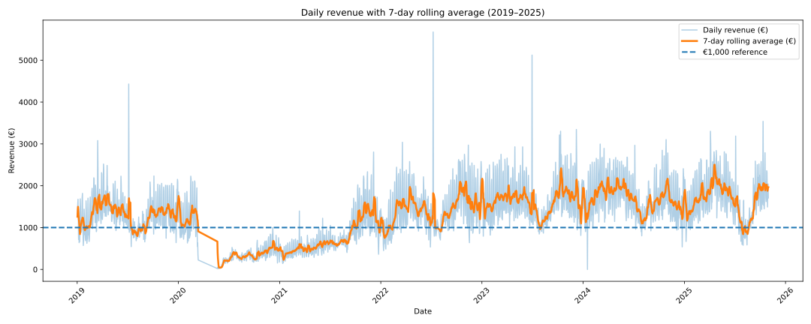

```{=html}
<nav class="page-nav">
  <div class="page-nav-links">
    <a href="#project-details">Detalles del proyecto</a>
    <a href="#video-demo">Demo en video</a>
    <a href="#team-awards">Equipo y premios</a>
    <a href="#contact">Contacto</a>
  </div>
  <div class="page-nav-lang">
    <a href="../en/">EN</a>
    <a href="./">ES</a>
  </div>
</nav>
```

::: {#top .hero-shell}
# Pythia - ciencia de datos para cafeterías { .hero-title }

::: {.hero-subtitle}
Proyecto final del Máster en Ciencia de Datos en UCM/NTIC, que combina predicción de demanda y análisis de reseñas de clientes en una herramienta práctica de apoyo a la decisión para cafeterías de especialidad.
:::

```{=html}
<div class="hero-skills">
  <span class="skill-chip">CRISP-DM</span>
  <span class="skill-chip">ETL / Preparación de datos</span>
  <span class="skill-chip">EDA</span>
  <span class="skill-chip">Ingeniería de variables</span>
  <span class="skill-chip">Predicción de series temporales</span>
  <span class="skill-chip">Prophet</span>
  <span class="skill-chip">NLP / Minería de texto</span>
  <span class="skill-chip">YAKE</span>
  <span class="skill-chip">Sentence-BERT</span>
  <span class="skill-chip">Evaluación de modelos</span>
  <span class="skill-chip">Benchmarking competitivo</span>
  <span class="skill-chip">Despliegue en Streamlit</span>
</div>
```

::: {.badge-row}
::: {.hero-badge}
<strong>Contexto operativo real</strong>
<span>Construido sobre dinámicas reales de ventas, sentimiento del cliente y variables externas de demanda en cafeterías de especialidad.</span>
:::
::: {.hero-badge}
<strong>Flujo analítico integrado</strong>
<span>Conecta predicción, benchmarking y minería de texto en un único sistema coherente de apoyo a la decisión.</span>
:::
::: {.hero-badge}
<strong>Entrega reconocida</strong>
<span>Obtuvo la calificación máxima y el 2.º puesto en un concurso de pitch.</span>
:::
::: {.hero-badge}
<strong>Resultado práctico</strong>
<span>Se entregó como una aplicación Streamlit pensada para apoyar decisiones de negocio del día a día.</span>
:::
:::

::: {.cta-row}
[Ver demo](#video-demo){.cta-button .cta-tertiary}
[Documento del proyecto](../assets/docs/project-document.pdf){.cta-button .cta-secondary}
:::
:::

## Detalles del Proyecto {#project-details .section-title}

Pythia está diseñado para leerse como una historia práctica: primero el problema operativo, después los datos y la metodología, luego las decisiones de modelado y, por último, el valor medible del resultado desplegado.

::: {.detail-grid}
::: {.content-card .detail-card .simple-card}
### Problema de Negocio

Las cafeterías de especialidad en mercados urbanos de alto tránsito afrontan un modelo operativo difícil: márgenes ajustados, stock perecedero, demanda volátil y fuerte competencia. Pequeños errores de planificación pueden afectar de forma material a la rentabilidad mediante desperdicio, ventas perdidas e ineficiencias de personal. Este proyecto apoya una mejor toma de decisiones combinando predicción de ventas y análisis de reseñas de clientes para guiar compras, planificación de personal y prioridades de mejora operativa.
:::

::: {.content-card .detail-card}
### Datos y Metodología

El proyecto sigue un enfoque CRISP-DM y combina fuentes estructuradas y no estructuradas en un único pipeline analítico. Las entradas incluyen cerca de 990 mil registros reales de ventas entre enero de 2019 y diciembre de 2025, más de 2.500 reseñas de clientes, alrededor de 6.000 reseñas de competidores y variables externas como meteorología, festivos y flujo de visitantes de CaixaForum.

Esto crea un marco único de apoyo a la decisión que conecta rendimiento operativo, sentimiento del cliente y factores contextuales de demanda de una forma técnicamente rigurosa pero fácil de interpretar para perfiles de negocio.

```{=html}
<div class="detail-visual-frame">
  
</div>
```

::: {.detail-caption}
Figura 1. Ingresos totales diarios y media móvil de 7 días, con línea de referencia en 1.000 EUR (2019-2025).
:::
:::

::: {.content-card .detail-card}
### Modelado

Para la predicción, se seleccionó Prophet tras compararlo con Regresión Lineal y XGBoost, ya que ofrecía el mejor equilibrio entre precisión, robustez e interpretabilidad. Para la minería de texto, el pipeline combina YAKE, NLTK y Sentence-BERT para extraer, normalizar y agrupar automáticamente los temas de feedback de clientes a partir de las reseñas.

Esto mantiene la estrategia de modelado en un plano práctico: las alternativas se comparan seriamente, pero el sistema final prioriza métodos que puedan explicarse, monitorizarse y utilizarse en un entorno operativo real.

```{=html}
<div class="detail-visual-frame">
  
</div>
```

::: {.detail-caption}
Tabla 1. Prophet frente a Regresión Lineal y XGBoost en el conjunto completo de prueba de 2025.
:::
:::

::: {.content-card .detail-card}
### Resultados e Impacto

Los modelos de predicción lograron resultados sólidos, con una predicción de ingresos totales de alrededor de 11,74% de MAPE en validación y 14,25% en monitorización en producción para enero de 2026.

El análisis de reseñas identificó comida, café y servicio como principales fortalezas del negocio, mientras que el precio apareció como el área de mejora más clara. Ambos componentes se desplegaron en una aplicación Streamlit, convirtiendo el proyecto en una herramienta práctica de negocio y no en un informe analítico estático.

```{=html}
<div class="detail-visual-frame">
  
</div>
```

::: {.detail-caption}
Tabla 3. Métricas de evaluación en producción para los modelos Prophet, enero de 2026.
:::

```{=html}
<div class="detail-visual-frame">
  
</div>
```

::: {.detail-caption}
Figura 8. Captura de pantalla del módulo de análisis de reseñas de la app Pythia.
:::
:::
:::

## Demo en video {#video-demo .section-title}

::: {.youtube-frame}
<iframe src="https://www.youtube.com/embed/gkD9bKw1ikY" title="Video demo de Pythia" allow="accelerometer; autoplay; clipboard-write; encrypted-media; gyroscope; picture-in-picture; web-share" allowfullscreen></iframe>
:::

## Equipo y Premios {#team-awards .section-title}

::: {.split-grid}
::: {.content-card .team-panel}
### Equipo

::: {.team-list}
<div class="team-item"><span>Anabel Baez Rodriguez</span><a class="icon-link" href="https://www.linkedin.com/in/anabel-baez-996348a4/" aria-label="Anabel Baez Rodriguez en LinkedIn"></a></div>
<div class="team-item"><span>Fatima Tawfik Vazquez</span><a class="icon-link" href="https://www.linkedin.com/in/fatimatawfikvazquez/" aria-label="Fatima Tawfik Vazquez en LinkedIn"></a></div>
<div class="team-item"><span>Genesis Hernandez Gallegos</span><a class="icon-link" href="https://www.linkedin.com/in/genesishernandezg/" aria-label="Genesis Hernandez Gallegos en LinkedIn"></a></div>
<div class="team-item"><span>Ilan Arvelo Yagua</span><a class="icon-link" href="https://www.linkedin.com/in/ilan-arvelo-yagua/" aria-label="Ilan Arvelo Yagua en LinkedIn"></a></div>
<div class="team-item"><span>Luca Iacomino</span><a class="icon-link" href="https://www.linkedin.com/in/luca-iacomino-58440b180/" aria-label="Luca Iacomino en LinkedIn"></a></div>
<div class="team-item"><span>Marcio Yassuhiro</span><a class="icon-link" href="https://www.linkedin.com/in/yassuhiro-m/" aria-label="Marcio Yassuhiro en LinkedIn"></a></div>
:::
:::

::: {.content-card .awards-panel}
### Premios

::: {.awards-stack}
::: {.award-card}
### Calificación máxima
Pythia obtuvo la máxima evaluación académica en el Trabajo Fin de Máster.
:::

::: {.award-card}
### 2.º puesto en concurso de pitch
El proyecto también destacó en un contexto de presentación, validando su claridad, storytelling y posicionamiento práctico.

{.award-photo}

[Ver publicación en LinkedIn](https://www.linkedin.com/posts/ganadores-competici%C3%B3n-becas-ds-ntic-master-ugcPost-7434270925170323456-QIfv?utm_source=share&utm_medium=member_desktop&rcm=ACoAAFKEmJ4BXrPRzmBCAnGrHF7nwaxBzRCsCh0)
:::
:::
:::
:::

## Contacto {#contact .section-title}

::: {.contact-actions}
[LinkedIn](https://www.linkedin.com/in/yassuhiro-m/){.cta-button .cta-secondary}
[Repositorio del proyecto Pythia](https://github.com/lucaiaco21/Cafe-Madrid---TFM-Project){.cta-button .cta-tertiary}
[GitHub](https://github.com/YassuhiroM){.cta-button .cta-tertiary}
:::
