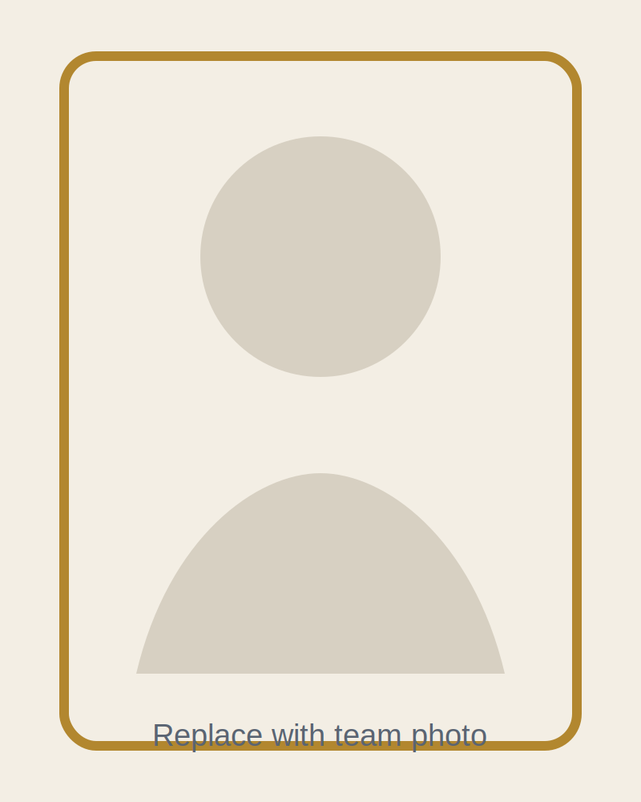
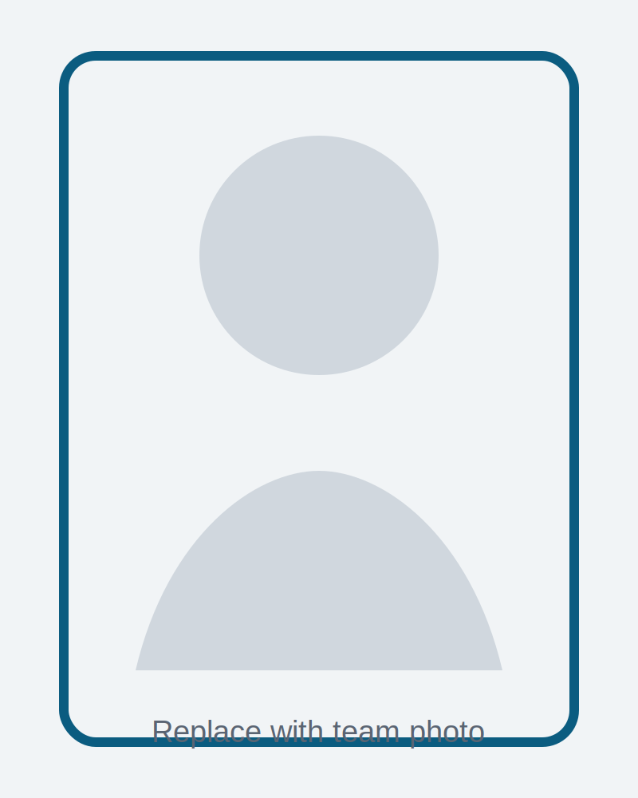
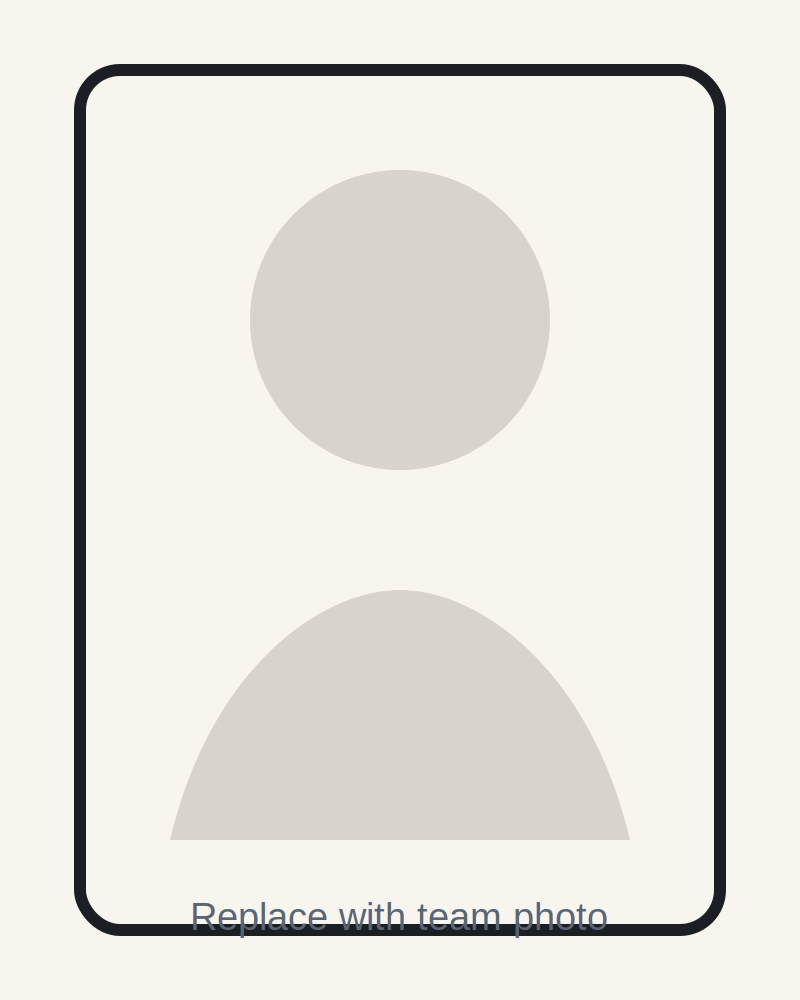

::: {.lang-switcher}
[English](../en/team.html) {.lang-link}
[Español](./team.html) {.lang-link}
:::

## Equipo { .section-title }

Pythia fue construido por un equipo con foco compartido en calidad técnica, pensamiento de producto y comunicación clara.

::: {.team-grid}
::: {.team-card}
{.team-photo}
### Integrante Uno
Ciencia de datos, experimentación y enfoque analítico.
:::
::: {.team-card}
{.team-photo}
### Integrante Dos
Modelado, validación técnica e implementación.
:::
::: {.team-card}
{.team-photo}
### Integrante Tres
Narrativa de producto, presentación y comunicación con stakeholders.
:::
:::

::: {.callout-note}
Sustituye las imágenes de ejemplo en `/assets/images/team/` y actualiza nombres y roles en esta página. El diseño ya es responsive y está listo para fotos reales.
:::
